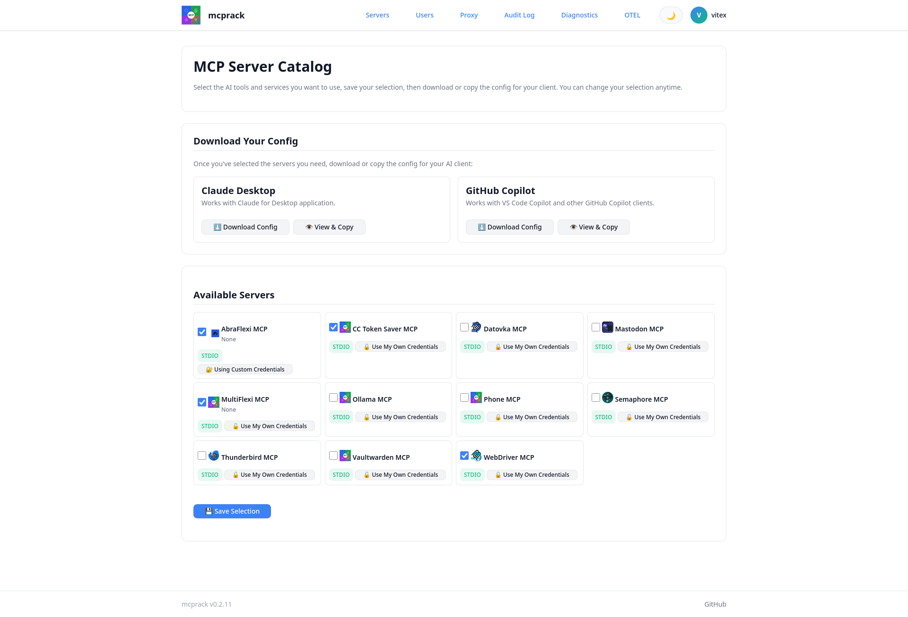

# mcprack

<div align="center">


**Model Context Protocol (MCP) Self-Service Catalog & Config Generator**


</div>

mcprack is a centralized platform for managing and distributing MCP (Model Context Protocol) server configurations across your organization. It solves the problem of how to securely provision AI clients (Claude Desktop, GitHub Copilot, and other MCP-compatible tools) with access to multiple backend services — without hardcoding secrets or requiring manual configuration on each machine.

🔗 **[Try the live demo](https://mcprack.vitexsoftware.com/?username=demo&password=demo)** (username/password prefilled: `demo` / `demo`)



## What mcprack Does

### The Problem
You have multiple MCP servers (tools that connect AI clients to your services: databases, APIs, knowledge bases, etc.). You want users to:
- Easily discover which servers are available
- Self-serve which ones they need
- Get a ready-to-use config file for their client
- Have credentials managed securely without access to raw secrets

### The Solution
mcprack provides:

1. **Admin UI** — Register MCP servers once, define environment variables and defaults, store secrets in Vaultwarden
2. **User Catalog** — Browse available servers, select which ones you need, choose your target client (Claude, Copilot, etc.)
3. **Config Generator** — Automatically builds a `.json` or `.env` config file tailored to each user with their chosen servers
4. **Credential Management** — Credentials never stored in mcprack's DB; every secret lives in Vaultwarden (optional override per user)
5. **HTTP Proxy** — Every stdio-based MCP server is exposed over HTTP by default, so remote clients can reach it; there's no local-spawn mode and no separate proxy service to deploy

### Typical Workflow

1. **Admin** registers a new server (e.g., `mastodon-mcp`):
   - Command: `/usr/bin/mastodon-mcp`
   - Environment variables: `MASTODON_INSTANCE`, `MASTODON_ACCESS_TOKEN`
   - Saves defaults in Vaultwarden secure note: `MCP-mastodon-mcp`

2. **User** logs into mcprack (local account or Active Directory):
   - Sees available servers in the catalog
   - Selects which ones they need: ✓ mastodon-mcp, ✓ postgres-mcp
   - Chooses target: "Claude Desktop"
   - Downloads `claude_desktop_config.json` with only those servers

3. **AI Client** (Claude) loads the config:
   - Starts each selected MCP server as a subprocess
   - Can now call functions and access tools from all those backends

Credentials are never exposed to the user or stored insecurely — they come from Vaultwarden at runtime.

---

## Authentication

**Local accounts** are always available. **LDAP/Active Directory** is optional and disabled by default — enable it during installation if you want users to authenticate with AD credentials instead.

## Key Features

- **Secrets in Vaultwarden, plain config in the DB** — Only the values an admin marks "citlivé"/sensitive (API keys, tokens, passwords) go to Vaultwarden; everything else lives directly in mcprack's own database, no Vaultwarden round-trip needed
- **User-level credential override** — Users can optionally provide their own credentials for any server (stored as `MCP-<server>-user-<username>` in Vaultwarden, or locally encrypted if Vaultwarden isn't configured)
- **Multi-client support** — Generate configs for Claude Desktop, GitHub Copilot, and other MCP-compatible clients
- **Admin config hand-off** — Admins can view and download any user's client config from Admin → Users, for users who never log into the web UI themselves
- **Per-user proxy** — Every user connects remotely; stdio servers are spawned on demand, one isolated instance per (user, server) pair, with credentials resolved at spawn time — never embedded in a downloaded config
- **Vaultwarden integration** — Leverages the same `bw-cli` / Secure Note pattern used by the `mcp_rack` Ansible role
- **Works without Vaultwarden too** — If it's not configured, sensitive values fall back to a local Fernet-encrypted column instead; admins can migrate between the two deliberately from Admin → Vaultwarden diagnostics
- **LDAP/AD support** — Optional directory authentication for enterprise deployments

## Architecture


**Components:**
- **Flask App**: Core web service, handles auth, server management, config generation, and the per-user proxy
- **Database**: Server registry, users, selections, and non-secret server config (SQLite, PostgreSQL, or MySQL)
- **Vaultwarden**: Stores sensitive credentials only, when configured — see `secret_store.py`
- **Local encrypted fallback**: Used instead of Vaultwarden when it isn't configured; never both at once for the same value

## Use Cases

**Scenario 1: Team with shared MCP servers**
- Your team has built MCP servers for PostgreSQL, internal APIs, Slack, Jira, etc.
- Developers use Claude Desktop or GitHub Copilot on their own machines
- They need access to different subsets of these servers based on their role
- Solution: Deploy mcprack once, register each server, let users self-serve their configs

**Scenario 2: Enterprise deployment**
- Multiple teams, each with different access controls
- Need to integrate with Active Directory for SSO
- Credentials managed centrally in Vaultwarden
- Solution: mcprack with LDAP enabled, per-team server configurations

**Scenario 3: Remote teams**
- MCP servers hosted on internal network
- Users on different networks/VPNs need to access them
- Solution: this is the default and only mode — every user connects remotely through mcprack's built-in per-user proxy, no extra service to deploy

**Scenario 4: Multi-client support**
- Some users prefer Claude Desktop, others use GitHub Copilot
- Different clients have different config formats
- Solution: mcprack generates client-specific configs automatically

## Authentication

**Local accounts** are always available. **LDAP/Active Directory** is optional and disabled by default — enable it during installation if you want users to authenticate with AD credentials instead.

## Quick start (development)

```bash
python3 -m venv .venv
. .venv/bin/activate
pip install -r requirements.txt -r requirements-dev.txt

cp .env.example .env   # edit as needed
export $(grep -v '^#' .env | xargs)

flask db upgrade
flask create-admin
flask run
```

Open http://127.0.0.1:5000, log in with the admin account you just created,
register a server under **Servers**, then visit the catalog to select it and
download a config.

## Database

`SQLALCHEMY_DATABASE_URI` defaults to SQLite but PostgreSQL
(`postgresql+psycopg2://...`, needs `psycopg2-binary` /
`python3-psycopg2`) and MySQL (`mysql+pymysql://...`, needs `PyMySQL` /
`python3-pymysql`) both work — see `requirements-db.txt`.

## Credentials (Vaultwarden)

In the server edit form, each environment variable row has a "citlivé"
(sensitive) checkbox. Only rows marked sensitive — API keys, tokens,
passwords, and the HTTP auth token key, which is always forced sensitive —
ever leave mcprack's own database. Non-sensitive config (base URLs, regions,
log levels, ...) stays directly in the DB and never touches Vaultwarden.

Sensitive values (a server's defaults, and any personal override a user
sets) live in Vaultwarden — mcprack talks to it the same way the `mcp_rack`
Ansible role does (`bw-cli`, Secure Notes named `MCP-<server-name>` /
`MCP-<server-name>-user-<username>`, plain `KEY=value` lines) — *when
Vaultwarden is configured*. If `BW_SERVER` is unset, the same sensitive
values are stored instead in a local Fernet-encrypted column, keyed off a
subkey derived from `SECRET_KEY`. Which backend is authoritative is decided
purely by configuration, never by live reachability — an unreachable but
configured Vaultwarden is a hard error, not a silent fallback. Admins can
move data between the two deliberately from Admin → Vaultwarden diagnostics
(e.g. after configuring Vaultwarden for the first time, or before a planned
Vaultwarden outage).

### 1. Get an API key from Vaultwarden

1. Log in to the Vaultwarden web vault you want mcprack to use (e.g. the same
   instance `mcp_rack` already uses, such as
   `https://vaultwarden-dev.proxy.spojenet.cz`).
2. Go to **Account Settings → Security → Keys** (or **API Key**) and
   generate/view the API key. Note the **client_id**, **client_secret**, and
   your account's **master password** — these three plus the server URL are
   everything mcprack needs.

### 2. Set the connection variables

Set these four (plus optionally `BW_ITEM_PREFIX`, default `MCP-`) in your
environment — `.env` for local development, `/etc/mcprack/env` in
production (see `debian/README.Debian`):

```bash
BW_SERVER=https://vaultwarden-dev.proxy.spojenet.cz
BW_CLIENTID=user.xxxxxxxx-xxxx-xxxx-xxxx-xxxxxxxxxxxx
BW_CLIENTSECRET=xxxxxxxxxxxxxxxxxxxxxxxxxxxxxxxx
BW_PASSWORD=your-vaultwarden-account-master-password
```

`BW_BIN` (default `/usr/bin/bw`) and `BITWARDENCLI_APPDATA_DIR` (where `bw`
keeps its login/session state) rarely need changing from their defaults.

### 3. Verify the connection

Log in as an admin and open **Vaultwarden diagnostics** in the nav bar (or
go straight to `/admin/vaultwarden/wizard`). It checks each prerequisite in
order — `bw` installed, `BW_SERVER` set and reachable, API key valid,
master password unlocks the vault — and stops at the first failing step
with a specific fix, instead of just showing `bw`'s raw error text. Re-run it
after editing `/etc/mcprack/env` and restarting `mcprack.service` so the
updated environment is loaded.

Once every step is green, admins can save server credentials (they're
written straight to a `MCP-<server-name>` Secure Note) and users can
download/view configs (which read those notes back and merge in any
personal override).

## Audit log

mcprack keeps an append-only audit trail so a problem (a broken server, a
credential issue, an unexpected proxy) can be traced back to which MCP
server and which user caused it. It is **always on** — there is no
opt-in/opt-out flag, since this is a security feature, not an optional
convenience.

### What's logged

Each event records: timestamp (UTC), the acting user (if any — some events
are system-initiated, e.g. idle proxy cleanup), the MCP server involved, the
action, whether it succeeded, a short error code/message on failure, the
client's source IP/hostname, how long it took, and a `request_id` UUID that
correlates multiple events from a single incoming request (e.g. a
credential lookup followed by a proxy start).

Events currently logged:

- `login` / `login_failed` — every login attempt (`auth.py`)
- `config_download` — a user downloading their client config (`catalog.py`)
- `credential_access` — a server's secrets being resolved from Vaultwarden
  (`vaultwarden.py`) — logs *that* access happened, never the values
- `proxy_start` / `proxy_stop` — a per-user FastMCP proxy instance starting,
  being stopped by an admin, or reaped for being idle (`user_proxy.py`)
- `admin_change` — admin actions: server/user create/edit/delete, and audit
  archival runs themselves (`admin.py`, `flask audit-archive`)

### What's NOT logged

Request or response bodies, tool call arguments/results, and credential
values are never written to the audit log — only the fact that an access or
call happened. `error_message` is always a short, fixed string, never raw
request content.

### Viewing it

Admins can browse the trail at **Admin → Audit Log**
(`/admin/audit-log`), filterable by server, user, time window, and
errors-only. Click the 🔗 on a row to see every event sharing its
`request_id`. There is no way to edit or delete individual entries from the
UI — the table is append-only by design.

### Retention & archival

`AUDIT_RETENTION_DAYS` (default `90`) controls how long entries are kept.
Nothing deletes automatically — run the CLI command periodically (e.g. from
cron) to export old entries and then purge them:

```bash
flask audit-archive                       # archive entries older than AUDIT_RETENTION_DAYS, as JSON
flask audit-archive --format csv          # export as CSV instead
flask audit-archive --days 30             # override the retention window for this run
flask audit-archive --output /path/to.json
flask audit-archive --dry-run             # just report how many entries would be archived
```

The export always happens before anything is deleted, and the archival run
itself creates one more `admin_change` audit entry (who/when ran it, how
many rows were purged) — so even the cleanup of old rows leaves a trace.

## Observability (OpenTelemetry)

mcprack can export distributed traces and metrics over OTLP to any
self-hosted OpenTelemetry Collector (Grafana Alloy, the vanilla OTEL
Collector, Jaeger, Tempo, ...). Like the audit log, this is about an
intranet deployment being able to see what's happening — but unlike the
audit log, it is **opt-in**: with `OTEL_ENABLED` unset/false, `telemetry.py`
is a complete no-op (no spans, no metrics, no network calls), and none of
the `opentelemetry-*` packages even need to be installed.

### Architecture

```
mcprack (Flask + SQLAlchemy + FastMCP proxy)
   │  OTLP (grpc or http/protobuf)
   ▼
OTEL Collector / Grafana Alloy
   │
   ├──▶ Jaeger / Tempo   (traces)
   └──▶ Prometheus / Loki (metrics)
```

### Enabling it

Install the optional dependencies (`pip install -r requirements-otel.txt`,
or the `python3-opentelemetry-*` Debian packages — see `debian/control`),
then set:

| Variable | Default | Notes |
|---|---|---|
| `OTEL_ENABLED` | `false` | Master switch. Everything below is ignored while this is off. |
| `OTEL_EXPORTER_OTLP_ENDPOINT` | *(empty)* | Base URL of the Collector, e.g. `http://10.11.56.226:4318`. |
| `OTEL_SERVICE_NAME` | `mcprack` | `service.name` resource attribute. |
| `OTEL_EXPORTER_OTLP_PROTOCOL` | `http/protobuf` | See table below. |
| `OTEL_TRACES_SAMPLER` | `parentbased_always_on` | Passed through as a resource/env hint; not itself validated. |
| `OTEL_TRACE_UI_URL_TEMPLATE` | *(empty)* | URL template for the "View trace" link on an audit log entry's detail page — see below. |

### Supported `OTEL_EXPORTER_OTLP_PROTOCOL` values

| Value | Supported? | Notes |
|---|---|---|
| `http/protobuf` | ✅ (default) | Uses `opentelemetry-exporter-otlp-proto-http`, typically port `4318`. |
| `grpc` | ✅ | Uses `opentelemetry-exporter-otlp-proto-grpc`, typically port `4317`. Whatever port is in `OTEL_EXPORTER_OTLP_ENDPOINT` is used as-is — mcprack never rewrites it. |
| `http/json` | ❌ | **Not supported.** The Python OTLP SDK, unlike the JS SDK, ships no JSON-over-HTTP exporter — only protobuf-over-HTTP and gRPC exist. Setting this logs a startup warning and mcprack transparently falls back to `http/protobuf`; it never fails to start over this. |
| anything else | ❌ | Same fallback-with-warning behavior as `http/json`. |

Check **Admin → OTEL Diagnostics** (`/admin/otel/wizard`) to see the
effective (post-fallback) protocol, whether a fallback happened, and to
fire a one-off test span/metric at the configured endpoint.

### Example `.env` — testing against the shared 10.11.56.226 stack

```bash
OTEL_ENABLED=true
OTEL_SERVICE_NAME=mcprack-demo
OTEL_EXPORTER_OTLP_ENDPOINT=http://10.11.56.226:4318
OTEL_EXPORTER_OTLP_PROTOCOL=http/protobuf
```

Grafana itself is at `http://10.11.56.226:3000`; `4318` is the OTLP
http/protobuf receiver in front of it (Alloy or an OTEL Collector — verify
with your platform team which signals it currently forwards to
Loki/Tempo).

### Trying it locally instead

`docker-compose.otel.yml` brings up a local Jaeger (with its own built-in
OTLP receiver) so you can see traces end to end without touching the shared
instance:

```bash
docker compose -f docker-compose.otel.yml up -d
# then run mcprack with OTEL_EXPORTER_OTLP_ENDPOINT=http://localhost:4318
# Jaeger UI: http://localhost:16686
```

Add `--profile collector --profile grafana` to also get a Collector, Prometheus,
and a provisioned local Grafana (`http://localhost:3001`, anonymous
viewer access) for trying out the metrics dashboard below — see the
comments at the top of `docker-compose.otel.yml` for the exact ports and
`OTEL_EXPORTER_OTLP_ENDPOINT` to use in that mode.

### Grafana dashboard

`grafana/mcprack-otel-dashboard.json` is a ready-to-import dashboard
covering the three custom metrics above: MCP call rate (success vs error)
and p50/p95/p99 duration by server, config downloads by client type, and a
trace search panel scoped to mcprack's service name. Import it via
**Dashboards → Import** in any Grafana that has a Prometheus datasource
fed by the OTEL Collector's metrics exporter (e.g. the shared
`http://10.11.56.226:3000` instance, or the local one from
`--profile grafana` above) — you'll be prompted to pick that datasource
for `${DS_PROMETHEUS}` (and, optionally, a Tempo datasource for
`${DS_TRACES}`, if your Collector forwards traces there).

To jump straight from one specific audit log entry to its trace instead of
browsing the dashboard, use the "View trace" button described below —
that's the `audit.request_id`-correlated path, not this dashboard.

### What gets traced

Automatic: every Flask request/response (via
`opentelemetry-instrumentation-flask`) and every SQLAlchemy query (via
`opentelemetry-instrumentation-sqlalchemy`).

Custom spans around the operations that actually matter for troubleshooting
an MCP problem:

- `mcp.server.call` — a request forwarded through a user's per-user proxy to
  a stdio MCP server (`server_name`, `transport` attributes)
- `vaultwarden.lookup` — a Vaultwarden Secure Note read (`secret_name_hash`
  attribute only — a one-way hash of the item name, never the name or the
  secret value)
- `catalog.generate_config` — building a client config for download/view
- `mcp.proxy.start` / `mcp.proxy.stop` — per-user FastMCP proxy lifecycle

Metrics (OTEL Meter, not just traces):

- `mcp_server_calls_total` (counter; labels `server_name`, `result`)
- `mcp_server_call_duration_seconds` (histogram; label `server_name`)
- `config_downloads_total` (counter; label `client_type`)

**Credential and audit content never reaches a span or metric** — the same
rule the audit log follows (see above). Span/metric attributes are limited
to identifiers (server names, hashed secret names), outcomes, and
durations; request/response bodies and secret values are never attached.

### Correlating a trace with an audit log entry

The audit trail already generates a per-request UUID (`audit.py`,
`flask.g`) to tie together everything that happened during one incoming
request. mcprack does not overwrite OpenTelemetry's own (SDK-generated)
trace ID with that UUID — instead, every custom span tags itself with the
UUID as the `audit.request_id` **span attribute**, so you look a trace up
by that attribute rather than by trace ID. On the audit log's request
detail page (`/admin/audit-log/request/<id>`), the "View trace" button
builds its link from `OTEL_TRACE_UI_URL_TEMPLATE`, substituting
`{request_id}` (and the identical `{trace_id}` alias, for templates that
read more naturally that way) — point it at a saved search/query in your
trace UI that filters on that attribute, e.g. for Grafana/Tempo using
TraceQL:

```bash
OTEL_TRACE_UI_URL_TEMPLATE="http://10.11.56.226:3000/explore?left=%7B%22datasource%22:%22tempo%22,%22queries%22:%5B%7B%22query%22:%22%7B%20.audit.request_id%20%3D%20%5C%22{request_id}%5C%22%20%7D%22%7D%5D%7D"
```

Leave it unset and the button just says "not configured" instead of
linking anywhere.

## Tests

```bash
pytest
```

## Installation (Debian/Ubuntu package)

mcprack is published as a `.deb` on the VitexSoftware APT repository.

```bash
sudo apt install lsb-release wget
sudo wget -O /usr/share/keyrings/vitexsoftware.gpg https://repo.vitexsoftware.com/KEY.gpg
sudo wget -O /etc/apt/sources.list.d/vitexsoftware.sources https://repo.vitexsoftware.com/vitexsoftware.sources
sudo apt update

sudo apt install mcprack
```

The postinst wizard sets up the database via `dbconfig-common` (SQLite,
PostgreSQL, or MySQL), writes `/etc/mcprack/env`, runs migrations, and
creates an initial `admin` account (random password saved to
`/etc/mcprack/admin-credentials`). See `debian/README.Debian` for the
full post-install configuration steps, and [repo.vitexsoftware.com](https://repo.vitexsoftware.com/)
for other available packages.

## Packaging

See `debian/` — builds a `.deb` following the same conventions as other
VitexSoftware Flask apps (e.g. `abraflexi-yearend`): system Python packages,
no virtualenv, `gunicorn` + systemd. See `debian/README.Debian` for the
post-install configuration steps.

## Remote access to stdio MCP servers

Users always connect remotely — mcprack never assumes a user's Claude/Copilot
client runs on the same machine as mcprack itself. So a stdio server is never
handed to a client as a raw local spawn command: the downloaded config always
points at a per-user proxy URL (`/proxy/mcp/<token>/<server_id>`), served by
`mcprack.service` itself — no separate proxy service to install or enable.

The first time a user's client connects to that URL, mcprack spawns a
dedicated `fastmcp` subprocess for that (user, server) pair on demand,
resolving that user's credentials at that exact moment. Each user gets their
own isolated instance, even for a server several users have selected at once;
idle instances are cleaned up automatically after 15 minutes. This needs
`python3-fastmcp` installed (`apt install python3-fastmcp`) — see Admin →
Proxy instances for a live list of what's running.

See `debian/README.Debian` for more detail.

## Branding & Icons

mcprack includes several icon variants to represent the platform's five functional areas:

| Icon | Purpose | Colors |
|------|---------|--------|
| `mcprack-app-icon.svg` | App launcher / favicon (256×256) | 2×2 grid: Blue (Admin) / Green (Catalog) / Purple (Vault) / Teal+Orange (Registry/Proxy) |
| `mcprack-icon-composite.svg` | Hub diagram with labeled functions | Circular design with 5 surrounding functional rings |
| `mcprack-badge.svg` | Shield badge for documentation | Overlapping colored segments |
| `mcprack-rings.svg` | Concentric design | Rings around central MCP hub |
| `mcprack-functions-bar.svg` | Web header / banner | Horizontal stacked bar showing all 5 functions |

All icons are located in `static/` and are included in the AppStream metadata for app catalog discovery.

**Color scheme:**
- 🔵 Blue = Admin Panel (management & configuration)
- 🟢 Green = User Catalog (server selection)
- 🟣 Purple = Vaultwarden Vault (credential storage)
- 🟠 Orange = Server Registry (inventory)
- 🔷 Teal = HTTP Proxy (remote access)
